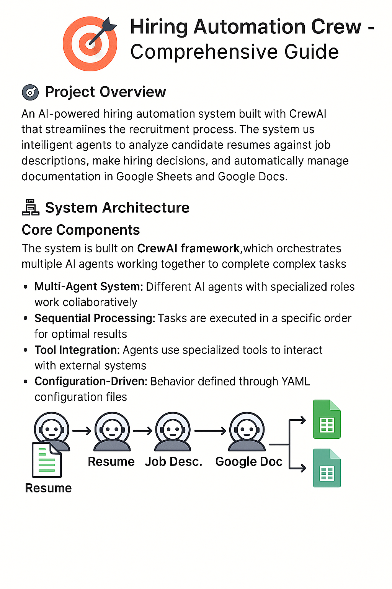
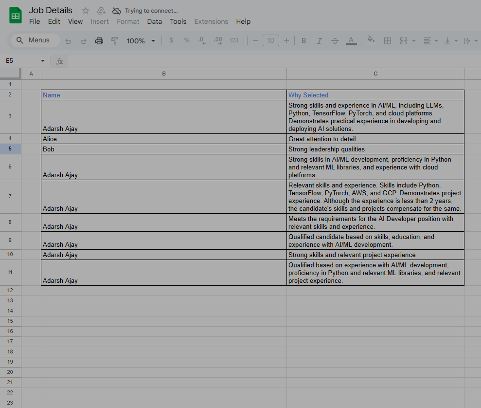
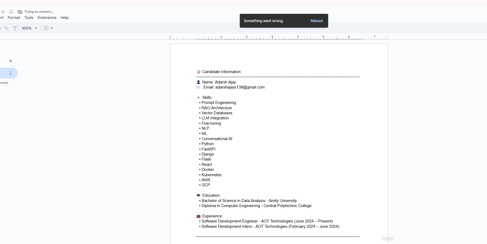

# Hiring Automation Crew - Comprehensive Guide

## 🎯 Project Overview

This is an AI-powered hiring automation system built with CrewAI that streamlines the recruitment process. The system uses intelligent agents to analyze candidate resumes against job descriptions, make hiring decisions, and automatically manage documentation in Google Sheets and Google Docs.

## 🏗️ System Architecture

### Core Components

The system is built on the **CrewAI framework**, which orchestrates multiple AI agents working together to complete complex tasks. Here's how it works:

- **Multi-Agent System**: Different AI agents with specialized roles work collaboratively
- **Sequential Processing**: Tasks are executed in a specific order for optimal results
- **Tool Integration**: Agents use specialized tools to interact with external systems
- **Configuration-Driven**: Behavior defined through YAML configuration files

## 📁 Project Structure Breakdown

```
hiring_automation/
├── README.md                    # Project documentation
├── pyproject.toml              # Python project configuration
├── knowledge/                  # Knowledge base for agents
│   └── user_preference.txt     # User context and preferences
└── src/hiring_automation/      # Main source code
    ├── __init__.py
    ├── crew.py                 # Core crew orchestration
    ├── main.py                 # Entry point and execution logic
    ├── config/                 # AI agent and task configurations
    │   ├── agents.yaml         # Agent definitions and personalities
    │   └── tasks.yaml          # Task descriptions and workflows
    └── tools/                  # Custom tools for external integrations
        ├── __init__.py
        ├── googledocs_tool.py  # Google Docs integration
        ├── pdf_reader.py       # PDF resume parsing
        └── spreadsheet_tool.py # Google Sheets integration
```

## 🤖 AI Agents Deep Dive

### HR Recruiter Agent

**Role**: Acts as an experienced human recruiter with AI capabilities

**Personality & Backstory**:
- Highly experienced HR professional
- Expert in matching candidates to roles
- Strategic and empathetic approach
- Skilled in relationship building and talent assessment

**Capabilities**:
- Resume analysis and parsing
- Job requirement matching
- Qualification assessment
- Decision making (Qualified/Rejected)
- Documentation and record keeping

**Tools Available**:
- PDF Reader Tool (for resume parsing)
- Google Sheets Tool (for tracking decisions)
- Google Docs Tool (for detailed documentation)

## 🛠️ Tools Ecosystem

### 1. PDF Reader Tool (`pdf_reader.py`)

**Purpose**: Extracts text content from PDF resume files

**How it Works**:
```python
# Uses PyPDF2 library
- Opens PDF file in binary mode
- Creates PdfReader object
- Iterates through all pages
- Extracts text from each page
- Combines into single text string
```

**Input**: File path to PDF resume
**Output**: Complete text content of the resume

**Background Process**:
1. File system access to read PDF
2. PDF parsing and text extraction
3. Text cleaning and formatting
4. Return structured text data

### 2. Google Sheets Tool (`spreadsheet_tool.py`)

**Purpose**: Appends candidate information to a tracking spreadsheet

**Authentication**: Uses Google Service Account credentials

**How it Works**:
```python
# Uses gspread library
- Authenticates with Google Sheets API
- Opens spreadsheet by ID
- Accesses first worksheet
- Appends new row with candidate data
```

**Input**: 
- Candidate name
- Qualification reason/rejection reason

**Output**: Confirmation of successful data append

**Background Process**:
1. Google API authentication
2. Spreadsheet access and selection
3. Data formatting and validation
4. Row insertion at end of sheet
5. Success confirmation

### 3. Google Docs Tool (`googledocs_tool.py`)

**Purpose**: Creates detailed candidate profiles in Google Docs

**Authentication**: Uses Google Service Account credentials

**Advanced Features**:
- Rich text formatting with emojis and visual elements
- Structured information layout
- Professional document formatting

**How it Works**:
```python
# Uses Google Docs API
- Authenticates with service account
- Accesses target document
- Formats candidate information with visual elements
- Inserts content at document end


```






**Input**:
- Candidate name
- Email address
- Skills list
- Education details
- Experience information

**Output**: Formatted candidate profile in Google Doc

**Background Process**:
1. Google Docs API authentication
2. Document access and content retrieval
3. Text formatting with visual elements
4. Content insertion at proper location
5. Document update and save

## 🔄 Workflow Process

### Task 1: HR Recruiter Analysis

**Objective**: Analyze resume against job description and make hiring decision

**Process Flow**:
1. **Resume Reading**: PDF Reader Tool extracts text from resume file
2. **Content Analysis**: AI agent analyzes resume content for:
   - Skills and competencies
   - Experience level and relevance
   - Education background
   - Career progression
3. **Job Matching**: Compares candidate profile against job requirements:
   - Required experience (2 years for AI Developer)
   - Technical skills (Python, ML libraries)
   - Educational background
   - Preferred qualifications
4. **Decision Making**: Makes binary decision (Qualified/Rejected)
5. **Documentation**: If qualified, logs to Google Sheets

**AI Processing**:
- Natural language processing of resume text
- Semantic matching between skills and requirements
- Experience quantification and validation
- Competency scoring and threshold evaluation

### Task 2: Google Docs Documentation

**Objective**: Create detailed candidate records for qualified candidates

**Process Flow**:
1. **Conditional Execution**: Only runs if candidate is qualified
2. **Data Extraction**: Pulls structured information from resume
3. **Profile Creation**: Formats comprehensive candidate profile
4. **Document Update**: Appends to master candidate document

**Data Structure Created**:
```
📝 Candidate Information
━━━━━━━━━━━━━━━━━━━━━━━━━━━━━━━━━━━━━━━━━━━━━━━━━━━━━━━━━━━━━━━━━━━━━━━━━━━━━━━━━━━━━━━━━━━━━━━━━━
👤 Name: [Candidate Name]
✉️  Email: [Email Address]

🔹 Skills:
   • [Skill 1]
   • [Skill 2]

🎓 Education:
   • [Education 1]
   • [Education 2]

💼 Experience:
   • [Experience 1]
   • [Experience 2]
━━━━━━━━━━━━━━━━━━━━━━━━━━━━━━━━━━━━━━━━━━━━━━━━━━━━━━━━━━━━━━━━━━━━━━━━━━━━━━━━━━━━━━━━━━━━━━━━━━
```

## ⚙️ Configuration System

### Agent Configuration (`agents.yaml`)

Defines the AI agent's personality, role, and capabilities:

```yaml
role: HR Recruiter
goal: Identify, attract, and engage top talent efficiently
backstory: Highly experienced HR Recruiter with proven track record...
```

**What This Does**:
- Sets the AI's decision-making context
- Defines professional expertise level
- Establishes evaluation criteria
- Creates consistent personality across interactions

### Task Configuration (`tasks.yaml`)

Defines specific workflows and expected outcomes:

```yaml
description: Analyze resume and job description, determine qualification
expected_output: "Qualified" or "Rejected" with justification
agent: hr_recruiter
```

**What This Does**:
- Provides clear task instructions to AI
- Sets output format requirements
- Links tasks to specific agents
- Defines success criteria

## 🔧 Environment Setup Requirements

### Required Environment Variables

```bash
GEMINI_API_KEY=your_openai_api_key_here
GOOGLE_APPLICATION_CREDENTIALS=path/to/service-account-key.json
GOOGLE_DOC_ID=your_google_document_id
SPREADSHEET_ID=your_google_spreadsheet_id
```

### Google Cloud Setup

1. **Service Account Creation**:
   - Create Google Cloud Project
   - Enable Google Sheets API
   - Enable Google Docs API
   - Create service account
   - Download credentials JSON

2. **Document Permissions**:
   - Share Google Sheet with service account email
   - Share Google Doc with service account email
   - Grant edit permissions

## 🚀 Execution Flow

### Main Execution (`main.py`)

**Input Configuration**:
```python
inputs = {
    'resume': 'path/to/resume.pdf',
    'job_description': 'detailed job posting text'
}
```

**Execution Steps**:
1. **Initialization**: CrewAI framework starts up
2. **Agent Loading**: HR Recruiter agent is initialized with tools
3. **Task Orchestration**: Tasks are loaded from configuration
4. **Sequential Processing**: Tasks execute in defined order
5. **Tool Integration**: Agents use tools as needed during execution
6. **Output Generation**: Results are produced and documented

### Background Processing

**During Execution**:
1. **PDF Processing**: PyPDF2 extracts and parses resume content
2. **AI Analysis**: OpenAI GPT models analyze text and make decisions
3. **API Calls**: Google APIs handle document and spreadsheet updates
4. **Error Handling**: System manages failures and retries
5. **Logging**: Detailed execution logs for debugging and monitoring

## 📊 Decision Making Logic


## 🔒 Security & Privacy

### Data Handling
- Resume content processed in memory only
- No local storage of sensitive information
- Google APIs use encrypted connections
- Service account credentials for secure authentication

### Access Control
- Service account has minimal required permissions
- Document access limited to specified sheets/docs
- No data persistence beyond Google services
- Audit trail through Google Cloud logging

## 🎛️ Customization Options

### Modifying Evaluation Criteria
- Edit agent backstory in `agents.yaml`
- Update task descriptions in `tasks.yaml`
- Adjust qualification thresholds in agent logic

### Adding New Tools
- Create new tool classes in `tools/` directory
- Implement BaseTool interface
- Add to agent tool list in `crew.py`

### Extending Functionality
- Add new agents for different roles
- Create hierarchical processing workflows
- Integrate additional external services
- Implement custom evaluation algorithms

## 🔍 Monitoring & Debugging

### Logging System
- Verbose execution logs
- Tool usage tracking
- API call monitoring
- Error reporting and stack traces

### Output Verification
- Google Sheets updates are immediately visible
- Google Docs changes can be tracked with version history
- Console output provides real-time execution status

This system provides a comprehensive, automated solution for initial candidate screening, combining the power of AI analysis with practical document management and tracking capabilities.
